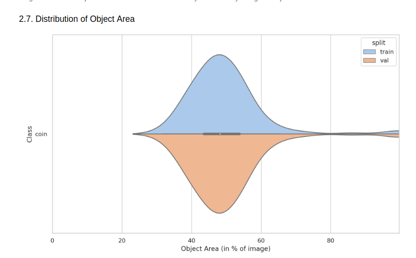
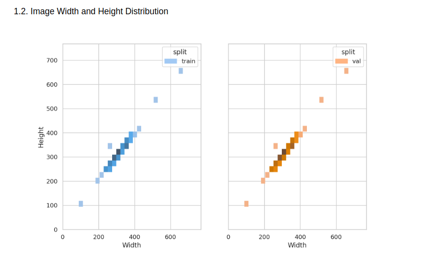
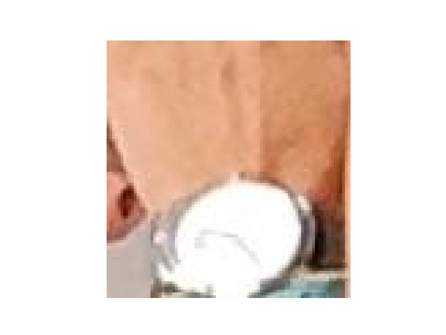
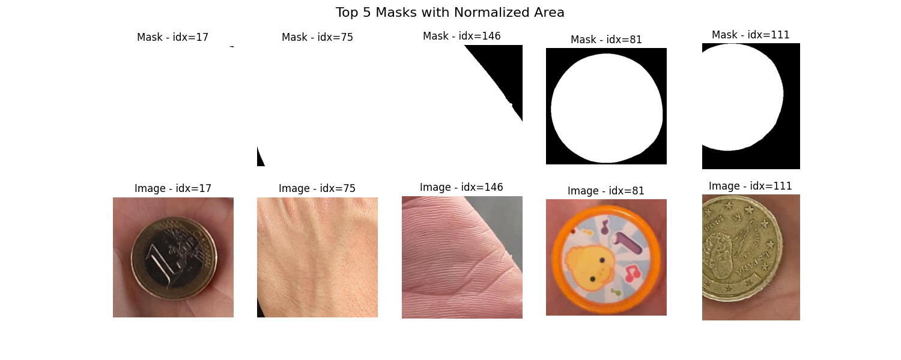

# Tech-Test-ML-Coin

## Task Description

The task in hand is to create a Computer Vision algorithm capable of segmenting coins from an Image obtaining the highest accuracy possible. Accuracy in this case is measured by means of Intersection over Union (IoU) metric. The [dataset](https://drive.google.com/file/d/1cF-u9N7miok5-KUiriTdvA62edxIs1I_) provided contains 150 image-mask pairs of coins.

## Environment Setup

First of all create a new virtual environment and activate it:

If you're using conda do:

```bash
conda create -n <env_name> python=3.11
conda activate <env_name>
conda install pip
```

If you're using venv do:

```bash
python3.11 -m venv <env_name>
source <env_name>/bin/activate
```

After that install the appropriate `pytorch` and `torchvision` according to your system from [here](https://pytorch.org/get-started/locally/).

Then install the rest of the requirements:

```bash
pip install -r requirements.txt
```

After you setup the environment, you can run the following command to download the dataset:

```bash
make build-dataset
```

## Dataset Profiling

Before starting to work on the solution, it is important to understand the dataset. For this purpose, I've used `Deci-AI`'s [data-gradients](https://github.com/Deci-AI/data-gradients) to profile the dataset and generate a report. The full report can be found [here](https://github.com/EduardoPach/Tech-Test-ML-Coin/blob/main/logs/Testing_Data-Gradients_Segmentation/Report.pdf).

To summarize the important findings of the report we have the following Figures:

<div style="display: flex; justify-content: space-between;">
    <figure style="text-align: center;">
        
        <figcaption>Figure 1 - The distribution from the mask area normalized by the total image area. We can see that we have a few images with very high normalized area</figcaption>
    </figure>
    <figure style="text-align: center;">
        
        <figcaption>Figure 2 - Height and width distribution from images (validation and train are same). Look at the (100, 100) point.</figcaption>
    </figure>
</div>

From Figure 1 we can see that we have a few images with very high normalized area. This means that we have a few images that the coin either takes up almost the whole image or we have something mislabeled. From Figure 2 we can see that the images don't have all the same sizes, however we have a very distinct point near (100, 100), which is worth taking a look at.

After further inspection the following images were found and removed from the dataset:

<div style="display: flex; justify-content: space-between;">
    <figure style="text-align: center;">
        
        <figcaption>Figure 3 - Smallest image which turned out not to be a coin.</figcaption>
    </figure>
</div>

<div style="display: flex; justify-content: space-between;">
    <figure style="text-align: center;">
        
        <figcaption>Figure 4 - Top 5 Images with highest normalized area.</figcaption>
    </figure>
</div>

From Figure 3 we can see that the smallest image isn't actually a coin, but a watch, thus it was removed. Furthermore, from Figure 4 we can see that 3 out of the 5 images are either mislabeled e.g. `idx=17` that doesn't have a proper mask or the image doesn't contain a coin e.g. `idx = 75` and `idx = 146`. Despite of not being a coin, `idx = 81` was retained because it sort of looks like a coin, but not one that is used in the real world. Nonetheless, we'll be able to see or solution will be able to properly segment it later on.

For any reference regarding this step look at the `./dataset/dataset_profiling.py` and `./dataset/inspection.ipynb`

## Solution

A solution is always dependent on the bussiness problem that we're trying to solve. In this case, we're trying to segment coins, but different requirements regarding where and how the final solution will be used are important to understand the best approach when thinking about the trade off between performance versus inference time and also its deployment complexity. Therefore, three different solutions were developed:

   - Classical Computer Vision (CV) approach using OpenCV
   - Zero-Shot Segmentation using CLIPSeg
   - Zero-Shot Segmentation using GroundedSAM

All of the experiments were logged using `Weights & Biases (wandb)` and a comprehensive report can be found [here](https://api.wandb.ai/links/eduardopacheco/tvh8ryui).
### Classical CV Approach

Uses classical computer vision algorithms to come up with the final segmentation mask. Since we have some differences in brightness (see [Report](https://github.com/EduardoPach/Tech-Test-ML-Coin/blob/main/logs/Testing_Data-Gradients_Segmentation/Report.pdf) for more info) between the images, preprocessing and postprocessing steps were used to improve the final result. The high level pipeline work as follows:

1. Getting Contours
    - Adjust Brigthness
    - Enhance Gray Scale Image
      - CLAHE
      - Sharpening
      - Blurring
    - Canny Edge Detection
    - Find Contours
2. Getting Initial Mask Proposal
    - Draw contours
    - Apply thresholding
    - Apply Gaussian Blur
3. Postprocessing
    - Fill initial mask

Since this pipeline involves a lot of hyperparameters a Optimization using [optuna](https://optuna.readthedocs.io/en/stable/) was performed to maximize `mIoU` the best configuration was logged to `wandb`

### CLIPSeg

A Zero-Shot Segmentation approach using CLIP from the paper [Image Segmentation Using Text and Image Prompts](https://arxiv.org/pdf/2112.10003.pdf), model weights are available at [Hugging Face](https://huggingface.co/CIDAS/clipseg-rd64-refined).

The high level pipeline work as follows:

1. Load CLIPSeg Model and Processor
2. Preprocess Image and Prompts
3. Generate Mask
   - Generate Mask proposal with CLIPSeg
   - Threshold Mask to get a better segmentation

In this case, the performance of the model is dependent on the `prompt` and the `threshold` value used in postprocessing. Thus, optuna was used to select the best `threshold` value  and also the best `model_id`, which chooses different configurations of the model (like size), and prompt was unique per experiment. The best configuration was logged to `wandb`.

### GroundedSAM

`GroundedSAM` is a Zero-Shot Segmentation approach that uses a pre-trained object detector called `GroundingDINO` to generate a bounding box proposal that is then fed to `SAM` another pre-trained model that generates the final segmentation mask. The `GroundedSAM` was used through the `autodistill-grounded-sam` library from `Roboflow` [here](https://github.com/autodistill/autodistill-grounded-sam).

`GroundedSAM` is the heaviest approach in terms of inference time from all the three approaches, but it is also the one that achieves the best performance. Therefore, no postprocessing was required. All experimentations were logged to `wandb` and the best configuration was selected.

### Notes

- `CLIPSeg` and `GroundedSAM` both were GPU accelerated with a `NVIDIA T4` from `Google Colab`
- `Classical CV` was run on a CPU from `Google Colab`
- No image augmentation was used in any of the approaches since training wasn't required
- None of the models were optimized for inference time.

## Results

As mentioned previously, a `wandb` report can be found [here](https://api.wandb.ai/links/eduardopacheco/tvh8ryui) with all the experiments, configuration and generated artifacts, however the best results are summarized in the following table:

| Approach | mIoU | Latency (ms) | Throughput (imgs/sec) |
| :---: | :---: | :---: | :---: |
| Classical CV | 82% | 10 | 103 |
| CLIPSeg | 0.85 | 89% | 13 |
| GroundedSAM | 97% | 2400 | 0.42 |

## Conclusion

In this project, three different approaches were used to solve the problem of coin segmentation. The best approach in terms of performance was `GroundedSAM`, however it is also the slowest one. The `Classical CV` approach is the fastest one, but it is also the one that achieves the worst performance. The `CLIPSeg` approach is a good trade off between performance and inference time, but it is still slower than the `Classical CV` approach. Therefore, the best approach to use is dependent on the bussiness problem that we're trying to solve. 

For instance, if we're dealing with batch predictions and we don't have any time constraints, then `GroundedSAM` is the best approach, however if we're dealing with real time or customer-facing predictions, then `Classical CV` is the best approach. It is also important to note that `CLIPSeg` is a good trade off between performance and inference time, but it is still slower than `Classical CV`. Thus, might be a good solution in the case `GroundedSAM` is to slow and `Classical CV` doesn't achieve the desired performance.

It's also worth mention that none of the Deep Learning approaches were optimized for inference time, thus it is possible to achieve better results by optimizing the models for inference time like using `TorchScript` or `ONNX` and also using `TensorRT` to optimize the models for the GPU.

Other approaches were also viable, like training a `YOLO` like model or using a pretrained vision model with a segmentation head like `Dinov2`. However, the approaches tested were quicker to implement and also achieved reasonable results and are, therefore, a good kickoff for next iterations with the stackholders.